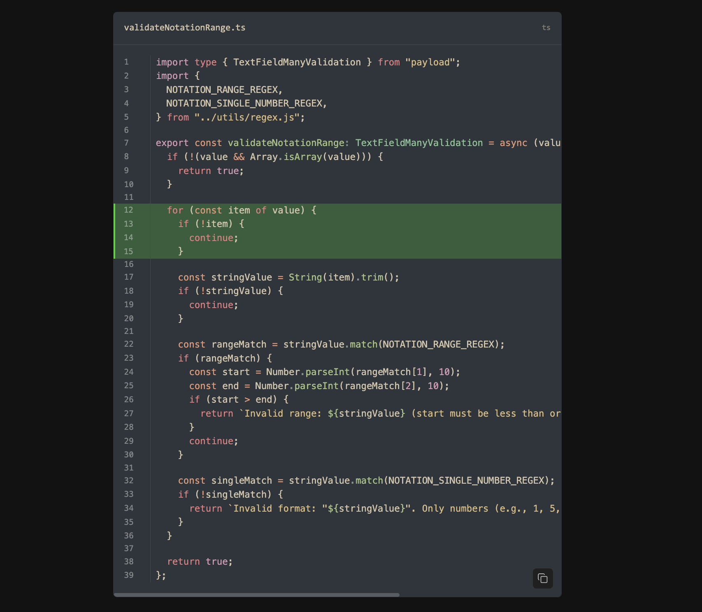

# Payload Shiki Code Plugin

A Payload CMS plugin that integrates [Shiki](https://shiki.style) syntax highlighting for code blocks with support for richtext fields. Provides server-side syntax highlighting with extensive theme and language support, lazy loading, and maximum customization options.




## Features

- Server-side syntax highlighting using Shiki
- 60+ programming languages supported
- 66+ themes (light and dark variants)
- Lazy loading of languages
- Field-based notation for line highlighting, diff markers
- Customizable display options (line numbers, language labels, wrapping (not working properly yet))
- Lifecycle hooks for extensibility
- TypeScript support with full type safety
- Cached highlighter instance for optimal performance

## Installation

```bash
npm install payload-shiki-code
# or
pnpm add payload-shiki-code
# or
yarn add payload-shiki-code
```

## Basic Usage

### 1. Configure the Plugin

Add the plugin to your Payload configuration:

```typescript
// payload.config.ts
import { buildConfig } from "payload/config";
import { payloadShikiCode } from "payload-shiki-code";

export default buildConfig({
  plugins: [
    payloadShikiCode({
      languages: ["javascript", "typescript", "python", "html", "css"], 
      displayOptions: {
        lineNumbers: true,
        showLanguage: true,
        wrapLines: false,
        copyButton: true,
      },
      shiki: {
        themes: {
          light: "github-light", // default global theme for light mode
          dark: "github-dark", // default global theme for dark mode
        },
        engine: "oniguruma", // or 'javascript'
      },
      // ... other options
    }),
  ],
  // ... rest of your config
});
```


If you need dark mode support, make sure add following to your global css:

```css
:root {
  color-scheme: light dark;
} 
```

### 2. Add Code Block to Richtext Fields

Import and add the code block to your richtext fields:

```typescript
// In your collection/global configuration
import { lexicalEditor } from "@payloadcms/richtext-lexical";
import { BlocksFeature } from "@payloadcms/richtext-lexical/client";
import { createBlockConfig } from "payload-shiki-code";

export const Posts = {
  slug: "posts",
  fields: [
    {
      name: "content",
      type: "richText",
      editor: lexicalEditor({
        features: ({ defaultFeatures }) => [
          ...defaultFeatures,
          BlocksFeature({
            blocks: [
              createBlockConfig(), // Add the code block
            ],
          }),
        ],
      }),
    },
  ],
};
```

### 3. Add JSX Converters for Frontend Rendering

To render code blocks on your frontend, add the JSX converters:

```typescript
// For React frontend rendering
import { createCodeBlockJSXConverter } from 'payload-shiki-code/converters'

const jsxConverters: JSXConvertersFunction<NodeTypes> = ({
  defaultConverters,
}) => ({
  ...defaultConverters,
  ...createCodeBlockJSXConverter("test"), // extra classnames to the code block
});

// Use with your richtext rendering
<RichText data={post.content} converters={jsxConverters} />
```

## Configuration Options

### Plugin Options

```typescript
interface PayloadShikiCodeConfig {
  // Plugin control
  disabled?: boolean;
  blockSlug?: string; // default: 'code'
  blockInterfaceName?: string; // default: 'CodeBlock'
  cacheHighlighter?: boolean; // default: true

  // Language configuration
  languages?: Array<BundledLanguage | SpecialLanguage | LanguageRegistration>; // default: ['text'] - only these languages will be loaded

  // Shiki configuration
  shiki?: {
    themes?: {
      light: BundledTheme | ThemeRegistration;
      dark: BundledTheme | ThemeRegistration;
      [key: string]: BundledTheme | ThemeRegistration;
    };
    highlighterOptions?: Partial<HighlighterCoreOptions>;
    codeToHastOptions?: Partial<CodeToHastOptions>;
    transformers?: Array<ShikiTransformer | TransformerFactory>;
    engine?: "oniguruma" | "javascript";
  };

  // Display defaults
  displayOptions?: {
    lineNumbers?: boolean; // default: true
    showLanguage?: boolean; // default: true
    wrapLines?: boolean; // default: false
    copyButton?: boolean; // default: true
    startLineNumber?: number; // default: 1
    containerClasses?: string[];
    preClasses?: string[];
    codeClasses?: string[];
  };

  // Notation styling
  notationOptions?: {
    highlight?: {
      backgroundColor?: string;
      className?: string;
    };
    add?: {
      backgroundColor?: string;
      className?: string;
      symbol?: string;
    };
    remove?: {
      backgroundColor?: string;
      className?: string;
      symbol?: string;
    };
  };

  // Style customization
  styleOptions?: {
    cssVariables?: Record<string, string>;
    borderColor?: string;
    borderRadius?: string;
    backgroundColor?: string;
    padding?: string;
    fontFamily?: string;
    fontSize?: string;
    lineHeight?: string;
  };

  // Lifecycle hooks
  hooks?: {
    onHighlighterCreate?: (
      highlighter: HighlighterCore
    ) => void | Promise<void>;
    onHighlighterDispose?: () => void | Promise<void>;
    beforeRender?: (
      code: string,
      lang: string,
      options: any
    ) => void | Promise<void>;
    afterRender?: (
      html: string,
      code: string,
      lang: string
    ) => void | Promise<void>;
  };
}
```

## Language Configuration

The plugin uses a simplified language configuration to optimize bundle size and improve performance:

```typescript
export default buildConfig({
  plugins: [
    payloadShikiCode({
      // Only these languages will be loaded and available, aliases will be excluded
      languages: [
        'javascript',
        'typescript', 
        'python',
        'html',
        'css',
        'json',
        'markdown',
        'bash',
        'text', // Special language for plain text
        'ansi'  // Special language for ANSI colored output
      ],
    })
  ]
})
```

**Benefits:**
- **Reduced Bundle Size**: Only specified languages are included in the server bundle
- **Better Performance**: All languages are preloaded during highlighter initialization
- **Type Safety**: Uses `BundledLanguage` type for autocomplete and validation
- **Simplified Configuration**: Single `languages` array instead of multiple options

**Available Languages**: The `languages` option accepts:
- **BundledLanguage**: All standard programming languages supported by Shiki (60+ languages including `javascript`, `typescript`, `python`, `go`, `rust`, etc.)
- **SpecialLanguage**: Special languages like `text`, `ansi` for non-syntax-highlighted content  
- **LanguageRegistration**: Custom language definitions for unsupported languages

See the [complete language list](https://shiki.style/languages) for all available options.

## Advanced Usage

### Custom Transformers

Add custom Shiki transformers for additional functionality:

```typescript
import { payloadShikiCode } from "payload-shiki-code";
import type { ShikiTransformer } from "shiki";

const myCustomTransformer: ShikiTransformer = {
  name: "my-transformer",
  code(node) {
    // Modify the code node
    return node;
  },
};

export default buildConfig({
  plugins: [
    payloadShikiCode({
      shiki: {
        transformers: [
          myCustomTransformer,
          // Or use a factory function that receives plugin options
          (options) => ({
            name: "context-aware-transformer",
            code(node) {
              // Access plugin options here
              return node;
            },
          }),
        ],
      },
    }),
  ],
});
```

### Custom Themes

Use custom themes alongside or instead of bundled themes:

```typescript
import { payloadShikiCode } from "payload-shiki-code";

const myCustomTheme = {
  name: "my-theme",
  // ... theme definition
};

export default buildConfig({
  plugins: [
    payloadShikiCode({
      shiki: {
        themes: {
          light: "github-light",
          dark: myCustomTheme,
          custom: "dracula",
        },
      },
    }),
  ],
});
```

### Custom Copy Button

Replace the default copy button with your own implementation by passing it as a prop to the CodeBlock component:

```tsx
"use client";

import { CodeBlock, type CodeBlockProps } from "payload-shiki-code/rsc";
import type { CopyButtonProps } from "payload-shiki-code/client";

// Custom copy button component
const CustomCopyButton = ({ code, onCopySuccess, onCopyError }: CopyButtonProps) => {
  return (
    <button
      onClick={async () => {
        try {
          await navigator.clipboard.writeText(code);
          onCopySuccess?.();
          console.log("Code copied!");
        } catch (error) {
          onCopyError?.(error as Error);
        }
      }}
      className="my-custom-copy-button"
    >
      Copy to clipboard
    </button>
  );
};

// Use in your React component
function MyCodeBlock({ data }: { data: CodeBlockProps["data"] }) {
  return (
    <CodeBlock 
      data={data} 
      CopyButton={CustomCopyButton} // Pass your custom copy button here
    />
  );
}
```

The `CopyButtonProps` interface provides:
- `code`: The code content to copy
- `className`: Optional CSS class name
- `ariaLabel`: Optional aria-label for accessibility
- `onCopySuccess`: Callback when copy succeeds
- `onCopyError`: Callback when copy fails
- `successDuration`: Duration to show success state

You can customize the copy button appearance through the plugin configuration:

```typescript
export default buildConfig({
  plugins: [
    payloadShikiCode({
      styleOptions: {
        copyButton: {
          // Light theme styles
          backgroundColor: "rgba(255, 255, 255, 0.95)",
          color: "rgb(50, 50, 50)",
          borderColor: "rgba(0, 0, 0, 0.15)",
          hoverBackgroundColor: "rgba(255, 255, 255, 1)",
          hoverBorderColor: "rgba(0, 0, 0, 0.25)",
          successColor: "rgb(16, 185, 129)",
          successBackgroundColor: "rgba(16, 185, 129, 0.1)",
          successBorderColor: "rgba(16, 185, 129, 0.3)",
          successHoverBackgroundColor: "rgba(16, 185, 129, 0.15)",
          // Dark theme styles
          dark: {
            backgroundColor: "rgba(40, 40, 40, 0.95)",
            color: "rgb(220, 220, 220)",
            borderColor: "rgba(255, 255, 255, 0.15)",
            hoverBackgroundColor: "rgba(50, 50, 50, 1)",
            hoverBorderColor: "rgba(255, 255, 255, 0.25)",
            successColor: "rgb(16, 185, 129)",
            successBackgroundColor: "rgba(16, 185, 129, 0.1)",
            successBorderColor: "rgba(16, 185, 129, 0.3)",
            successHoverBackgroundColor: "rgba(16, 185, 129, 0.15)",
          },
        },
      },
    }),
  ],
});
```

Alternatively, you can override the CSS variables directly:

```css
:root {
  /* Light theme */
  --shiki-copy-button-bg: rgba(255, 255, 255, 0.9);
  --shiki-copy-button-color: rgb(59, 59, 59);
  --shiki-copy-button-border: rgba(0, 0, 0, 0.1);
  --shiki-copy-button-hover-bg: rgba(255, 255, 255, 1);
  --shiki-copy-button-hover-border: rgba(0, 0, 0, 0.2);
  --shiki-copy-success-color: rgb(34, 197, 94);
  --shiki-copy-success-border: rgba(34, 197, 94, 0.3);
  --shiki-copy-success-bg: rgba(34, 197, 94, 0.1);
  --shiki-copy-success-hover-bg: rgba(34, 197, 94, 0.15);

  /* Dark theme */
  --shiki-copy-button-bg-dark: rgba(30, 30, 30, 0.9);
  --shiki-copy-button-color-dark: rgb(200, 200, 200);
  --shiki-copy-button-border-dark: rgba(255, 255, 255, 0.1);
  --shiki-copy-button-hover-bg-dark: rgba(40, 40, 40, 0.95);
  --shiki-copy-button-hover-border-dark: rgba(255, 255, 255, 0.2);
  --shiki-copy-success-color-dark: rgb(34, 197, 94);
  --shiki-copy-success-border-dark: rgba(34, 197, 94, 0.3);
  --shiki-copy-success-bg-dark: rgba(34, 197, 94, 0.1);
  --shiki-copy-success-hover-bg-dark: rgba(34, 197, 94, 0.15);
}
```

### Lifecycle Hooks

Hook into the plugin lifecycle for custom functionality:

```typescript
export default buildConfig({
  plugins: [
    payloadShikiCode({
      hooks: {
        onHighlighterCreate: async (highlighter) => {
          console.log(
            "Highlighter created with themes:",
            highlighter.getLoadedThemes()
          );
        },
        beforeRender: async (code, lang, options) => {
          // Log or modify before rendering
          console.log(`Rendering ${lang} code block`);
        },
        afterRender: async (html, code, lang) => {
          // Process the generated HTML
        },
      },
    }),
  ],
});
```

## Block Fields

The code block includes the following fields that users can configure:

### Code Tab

- **Language**: Select from preloaded languages
- **File Name**: Optional filename display
- **Notation Type**: Choose from 'add', 'remove', or 'highlight'
- **Notation Range**: Specify line ranges (e.g., "1-5, 7, 10-12")
- **Code**: The actual code content

### Config Tab

- **Light Theme**: Select theme for light mode
- **Dark Theme**: Select theme for dark mode
- **Show Line Numbers**: Toggle line number display
- **Show Language Label**: Toggle language label display
- **Wrap**: Enable/disable line wrapping

## Performance Considerations

- **Cached Highlighter**: By default, the plugin caches the Shiki highlighter instance for optimal performance
- **Bundle Size Optimization**: Only the languages specified in the `languages` config are loaded, reducing server bundle size, the code block is a React server component, no extra JavaScript code for your frontend
- **Server-Side Rendering**: All syntax highlighting happens on the server for better performance
- **Language Preloading**: All configured languages are loaded when the highlighter is created, eliminating runtime loading delays

## License

[MIT](./LICENSE)

## Contributing

Contributions are welcome! Please read our contributing guidelines and submit pull requests to our repository.

## Support

For issues and questions:

- Create an issue on our GitHub repository
- Check the [Shiki documentation](https://shiki.style) for Shiki-specific questions
- Refer to [Payload CMS documentation](https://payloadcms.com/docs) for Payload-related questions
